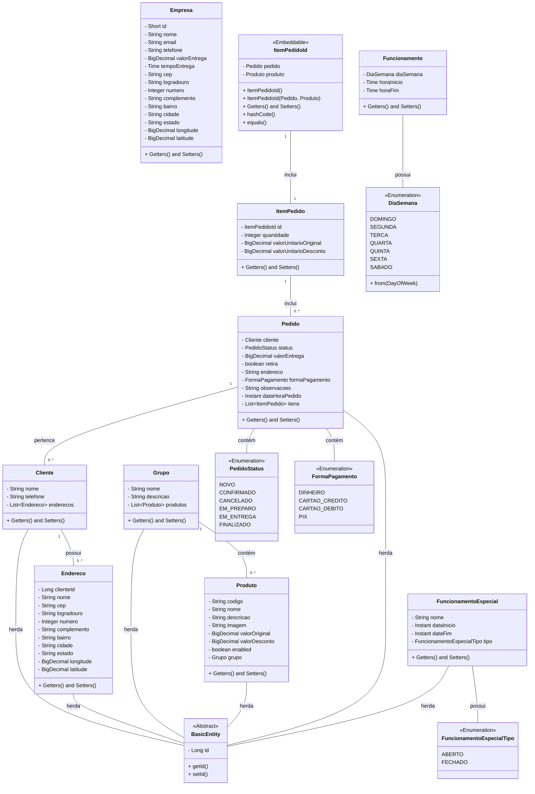
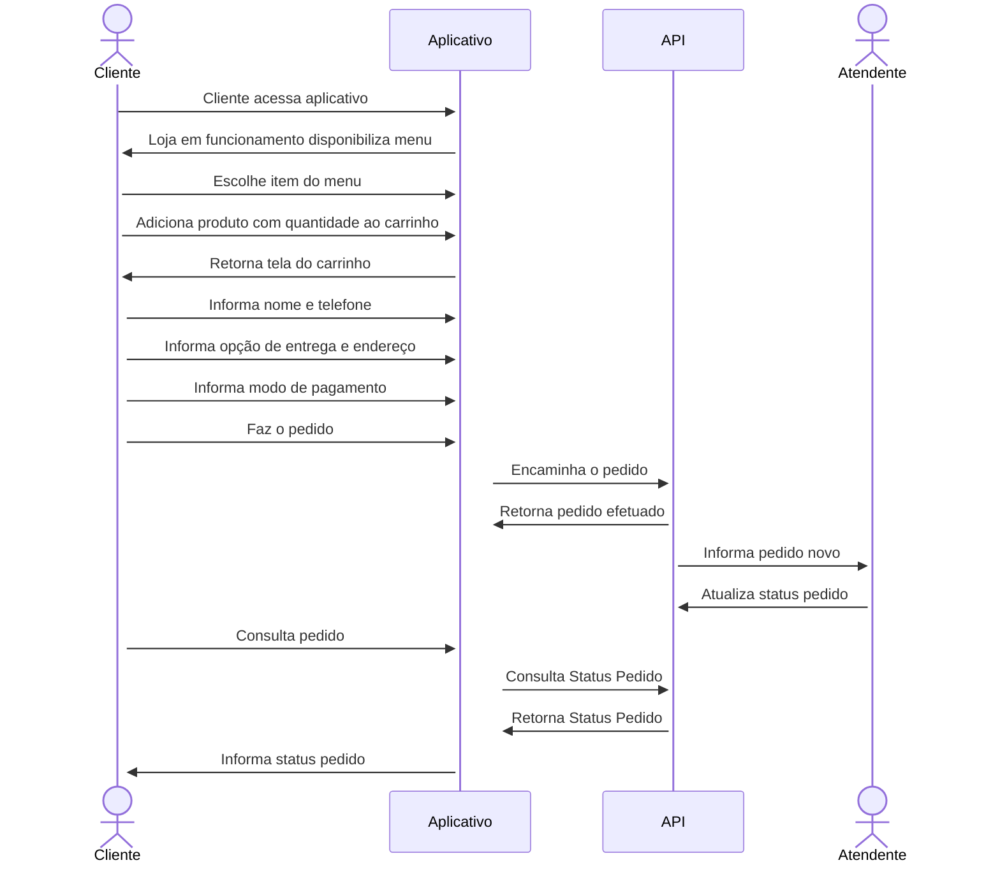
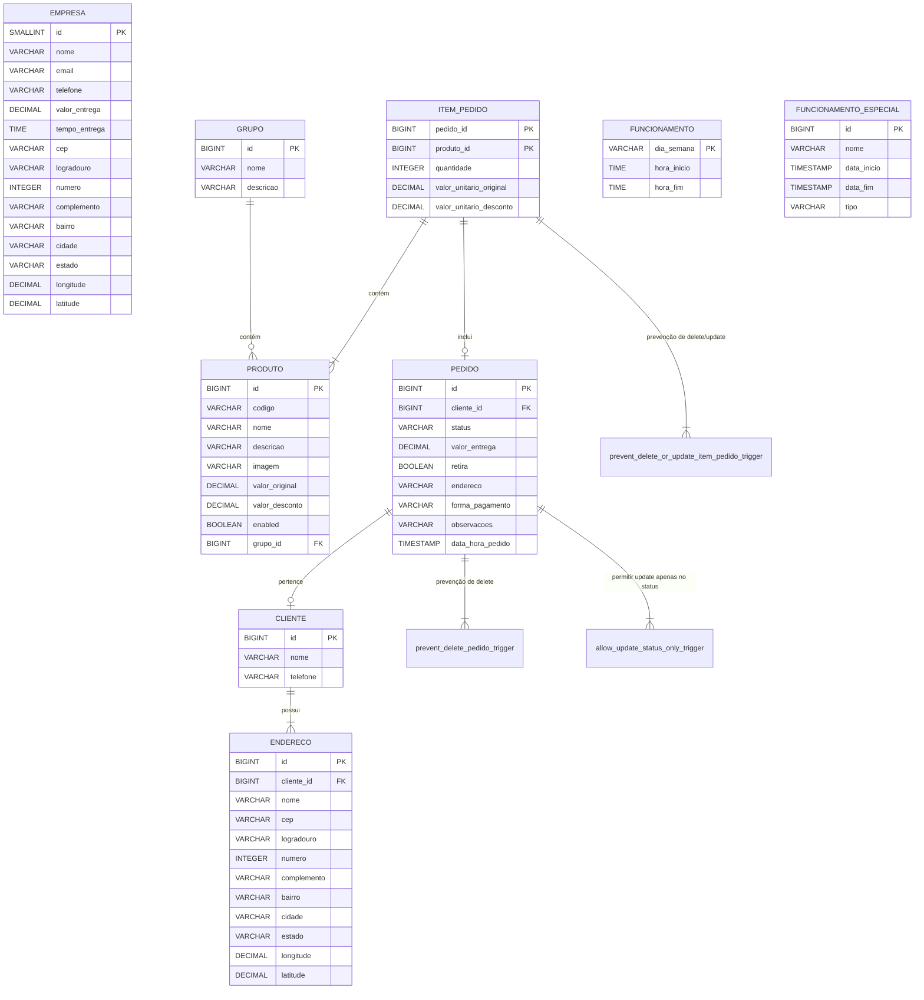
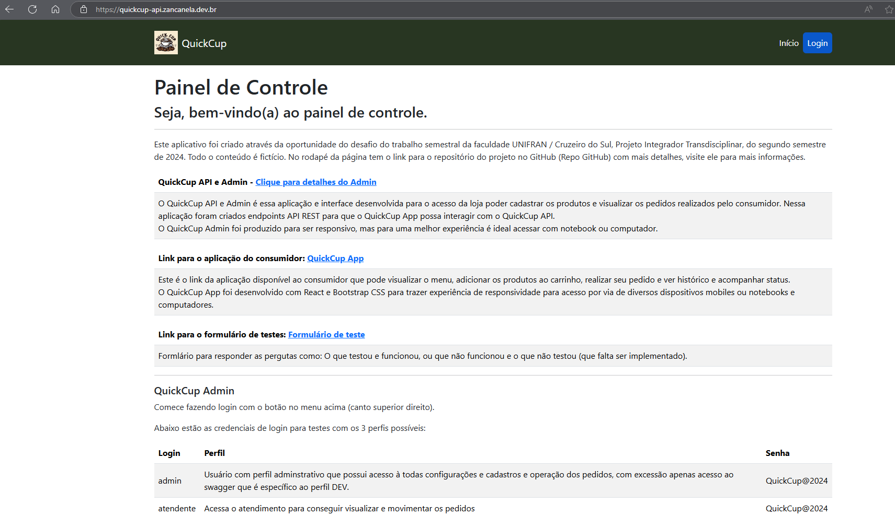
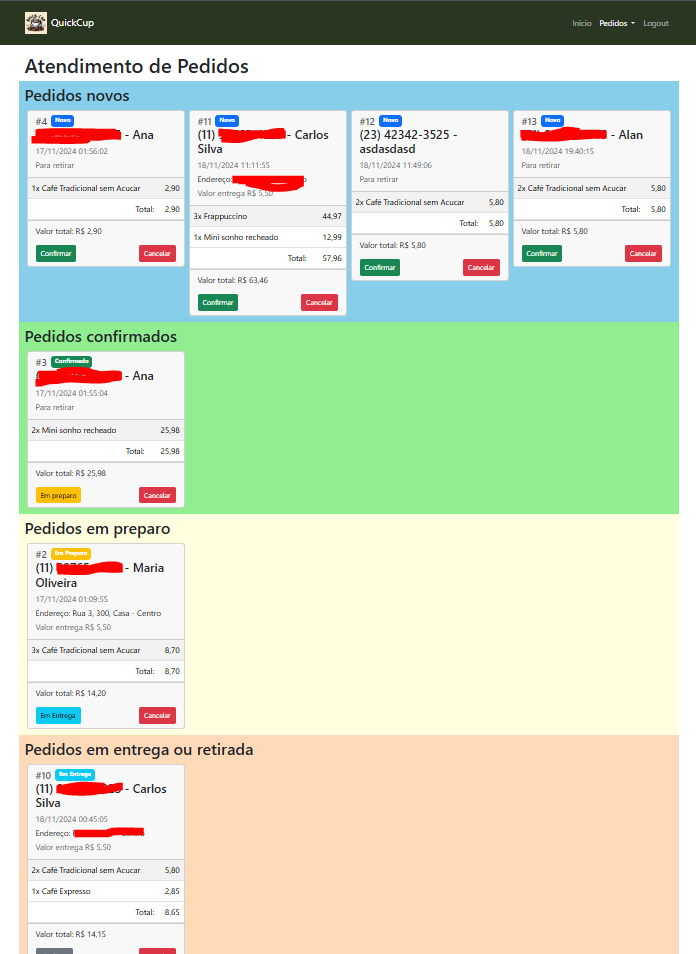
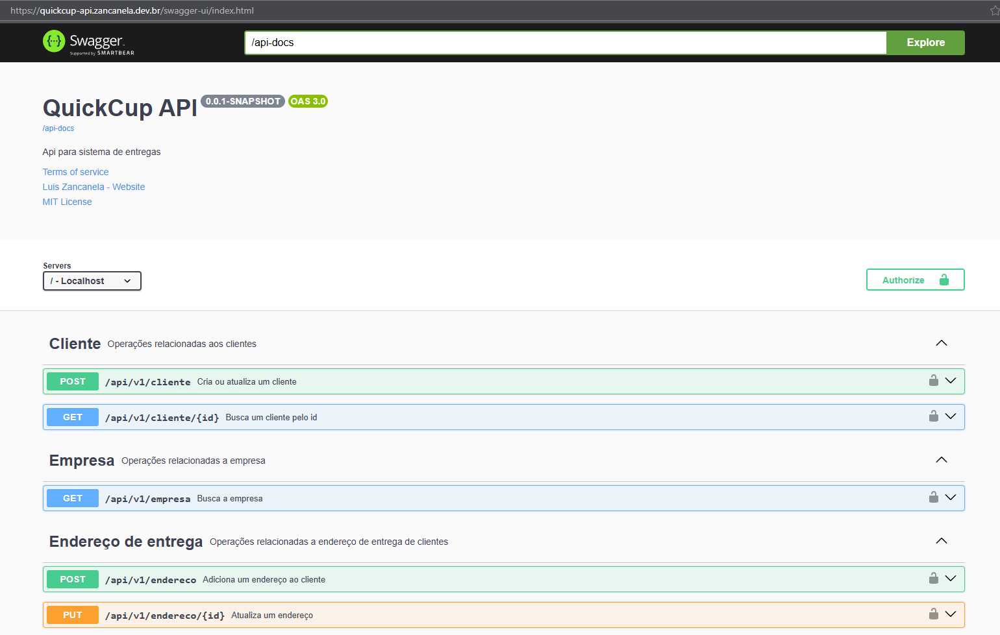
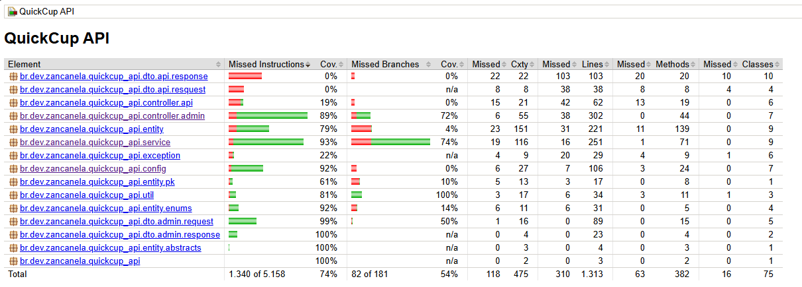

[](https://github.com/didifive/quickcup-api/commits/main)

[](https://luiszancanela.dev.br/)


[](https://www.jetbrains.com/idea/)

![technology Java](https://img.shields.io/static/v1?color=red&label=Technology&message=Java&style=for-the-badge&logo=data:image/png;base64,iVBORw0KGgoAAAANSUhEUgAAAC0AAAAtCAYAAAA6GuKaAAAABGdBTUEAAK/INwWK6QAAABl0RVh0U29mdHdhcmUAQWRvYmUgSW1hZ2VSZWFkeXHJZTwAAAZRSURBVHjaYvz//z8DzQEjoziQnALECQz//3+l1DiAAGJioA/4BsSuQBxADcMAAohejgbZwwPEHtQwDCCA6OVoJSBmBmJ1YFJhptQwgACil6PdoTQb1PEUAYAAYqJTJsyA8l4A8W9KjQQIICYaO5gfSM4GYnmoyGEGKhRXAAEENoMmmIHBBIhPAfF/KH4CxDLUMBsggGjl4BQgfovk4L9AHEAt8wECiNqOFQbiJUiOheEsJDXsUE9lkWsPQABR08EaQHwCzbHfgTgVzbGXoNiBXLsAAohaDpYH4ptoDn4BxO5QeQcgPgYV3w3EopTYBxBA1HAwDxAfRXPwBSDWgcp3A/EfqPhUIGal1E6AAKKGoyvRHLwPiCXAjmNgWIck3gvEjNSIWYAAotTBgkD8GMlhx4GYHyo3GUl8EzUzPEAAUepoL7RiDZaGTYH4N1T8KxBrUtPRAAFEaY3Ij8T+C8TPoWxLIGaBsr8D8UNqVrQAAUSpo28B8T8oG+RISSj7C5IaISCOpqajAQKIUkdfhmJwSwOINaDsC9CQh4nXA9sh0tRyNEAAMVHYcPkFbRDBgAWUvgjE55DEQQ4uppajAQKIGkUeFxAfgWa650AsABUPRisKXwOxCDUyIkAAUatG1AbiV1DHJSCJz0YrXfSpYR9AAFGz7eEExJ+B+Ay8EmFg4ATic1BHv6G0+oZhgABiomI62wckI4FYFYi9oGKg4u4BVMVsIP81js6CFBA7AbEbMRkWIIAYie5IMDJyA0ltINaE9kRkof29M0DHTENSZwUk2YFi+6F67kO7WbZAsY9YumK9QBwC1gMBr4C4DKh2IS6nAAQQMdHOCMSJQHwDqZYDZbhZQBwJxIp49PoA8QFwOxtVnAmIxaE4GojLkDLzf6g9prjMBQggwiHNyAgK0UdoAy8TgHgvEL+BdlRBhvyB0szQioYNPGQA4X+DVjxSQKwIja0PQBwFdMVLqD0gPe1AXAK1Zy5QLgWbkwACiJiQ5gbi7Vh6IyD8D4h/AfEPIP4GxaCG/09oc/QPFj0vgbgLiKWw2GUILWVA6p7hchNAALEQkcG+AkMhCMiKBeJAIDYFYk5oCILSISse3X+gsXEJiI8A8SEgPgk08wsO9d5IFd4lXIYCBBAjyT16yLCAG9QDx4H4JzQpMEId+RPa9ngLxM/ASYuYQUdGRhcguQbaCAMlORegvkPYlAIEEDnlcQUQP4U29nkIqGUGYjkg9gTiGiBeBMS+WNQ5A/EHaLIAJbEYfOYCBBBpIc3IyAEkbwKxHDQ0QJnoKRC/A+If0EYSKMlxAbEgNPOJADEHmkmgDFcNcQFjBnQYGJTcdgJxK1D8MD5nAAQQOSFtB8R7oBnuP5H4J7SHsxvaowEVlSxA3A6t/lfAOxBEYIAAYiR7lIqRURLaqoNVNkLQUP4JLc5ewtM0A8M9IH4MtPEbkn5QhjOCpvlXpFgNEEDkOZqRkRfasNcC4haiLGVkZIM2ZSkGAAHEQqa+OqRKwADooCPgkISUGN+haZsXmvZVoNU/qH0xCUjPQglxMgBAAJHbomslIT2j4/NALE1JKw8ggFiIKJNVoRhUnYMaQAeBuANaNUdAQ5KDQNj8hjaaTgDxHiD+iMM+NWga/4HPMIAAwp6mGRlB0VoLxJ7QogvUm94P7UbtBRp6F6qOHdqWUIW2K0CZkQ+a7EAWv4dmxtvgTvD//5/xBBDInh3gCub//258jgYIIFzRfxApOt+CRzhBLTLqdRi4wK1DYM0KxEVAvAzaHQPZFw5vCeLQDxBAuEK6AdyDRgVfoZntJrQYew6tVD5Dk8pPaDX+D6mVxwHNkPzQSkYKmjlhMYM8/3IAiNvAbRNQBQNspAFduA1bQAMEEL7QCIVWIp8oyHT4KptbQLwAiGOBWB3cFWNgSALiu9BmAs5ZA4AAIqY9rQCtQJSQ2sRcSCHJAm2ZMUEbTb+gGe83NAZAme4TNH2DKhxQl+sJtFElADXbEYj9oLFxDVwH/P9/AZeTAAKI1LaHMJCcBI1yVqiD/0Az3S9o+fwbqUMAw0xQD4IyqRh0HEQKbdwFNE6yDFqOf8bnDIAAItXRrFDLlKFFnSLUAaC+nig07fJC29us0DT7D+qRr9AQfwvND0+h/UdQSXQVXNX///+XGGcABBgAIku3g4p9ZV8AAAAASUVORK5CYII=)


# QuickCup API ☕

API Back-end com Java e Spring Boot e Front-end Administrativo com Thymeleaf para delivery de uma cafeteria.

## 🎯 Objetivo

Este aplicativo foi criado através da oportunidade do desafio do trabalho semestral da
faculdade UNIFRAN / Cruzeiro do Sul, Projeto Integrador Transdisciplinar, do segundo
semestre de 2024. Todo o conteúdo é fictício. 

O defasio consistia em desenvolver um sistema para gerenciamento de delivery para uma cafeteria.

Para a solução, foi criado o sistema QuickCup com dois módulos:

- QuickCup API e ADMIN: O QuickCup API e Admin é essa aplicação e interface desenvolvida para o acesso da loja poder cadastrar os produtos e visualizar os pedidos realizados pelo consumidor. Nessa aplicação foram criados endpoints API REST para que o QuickCup App possa interagir com o QuickCup API.
  O QuickCup Admin foi produzido para ser responsivo, mas para uma melhor experiência é ideal acessar com notebook ou computador. (Esse repositório contém o QuickCup API e Admin)
- QuickCup APP: O QuickCup App foi desenvolvido com React e Bootstrap CSS para trazer experiência de responsividade para acesso por via de diversos dispositivos mobiles ou notebooks e computadores. Link para o repositório do APP: [didifive/quickcup-app](https://github.com/didifive/quickcup-app)

## 🔧 Principais Tecnologias

- Java 17
- Maven
- Spring Boot 3.3.5
- Spring Web
- Spring Data JPA
- PostgreSQL
- Flyway
- Thymeleaf
- Docker e Docker Compose 3 para desenvolvimento local com postgres
- IntelliJ IDEA

## 🔣 Diagramas

Os diagramas foram criados na sintaxe [Mermaid](https://mermaid.live/).

### Diagrama de Classes



### Diagrama de Sequencia



### Diagrama de Entidade e Relacionamento



-----

## 📷 Prints do Projeto

### Tela Inicial do QuickCup Admin


### Tela Atendimento Pedidos


### Swagger QuickCup API
  


### JaCoCo Coverage


-----

## ✔️ Testes
Os testes foram feitos utilizando JUnit 5, Mockito e MockMVC com Hamcrest.

Para executar os testes pode executar sua IDE ou

Utilizando o terminal (PowerShell, Bash ou similiar), basta executar na pasta do projeto o comando abaixo:

```
./mvnw clean verify -Dspring.profiles.active=test
```

-----

## ⚙ Executando o projeto localmente
Antes de mais nada, é preciso possuir no mínimo JDK 21 LTS instalado na máquina em que
irá executar. A execução do projeto pode ser feita utilizando recurso de sua IDE ou 
com comando (demonstrado no próximo item).

### 🌍 Variáveis de Ambiente

Antes de executar é preciso ter atenção e configurar as variáveis de ambiente:

- `SPRING_PROFILES_ACTIVE`: Ambiente de desenvolvimento ou produção
- `PGHOST`: Host Postgres
- `PGPORT`: Porta Postgres
- `PGDATABASE`: Nome do database Postgres
- `POSTGRES_USER`: Usuário Postgres
- `POSTGRES_PASSWORD`: Senha Postgres
- `QUICKCUP_API_KEY`: Chave de acesso da API
- `QUICKCUP_USERS_DEFAULT_PASSWORD`: Senha padrão para os usuários do painel administrativo
- `CROSS_ORIGIN_URLS`: URLs para configurar o CORS para acesso de aplicativos externos aos endpoints REST API
- `LINK_FORMULARIO_TESTES`: URL para acessar o formulário de testes (para carregar no index do painel administrativo, não afeta o funcionamento da aplicação)
- `LINK_APLICACAO_CLIENTE`: URL para acessar a aplicação do cliente (para carregar no index do painel administrativo, não afeta o funcionamento da aplicação)

Para facilitar eu deixei o arquivo `.env.sample` com as variáveis de ambiente. Basta renomear para `.env` para que a aplicação
carregue as informações das variáveis de ambiente.

### 🐘 Postgres Docker Compose

Essa aplicação depende do Postgres para funcionar, acima existem variáveis de ambiente para configurar o acesso ao banco de dados.  
Caso já possua um banco de dados Postgres, basta ajustar as variáveis de ambiente para acessá-lo.  
Nesse projeto utilizamos o Postgres Docker Compose para facilitar a execução do projeto localmente sem necessitar de ter o Postgres instalado
ou configurado. Para executar o Postgres Docker Compose, basta executar na pasta do projeto o comando abaixo:

```
docker compose up
```

O docker compose também está preparado para ler as informações do arquivo `.env` mencionado no item anterior, isso facilita a integração da
aplicação com o banco de dados já que ambas utilizando variáveis de ambiente em comum.  
No docker compose `docker-compose.yml` também foi configurado para subir uma instancia do pgadmin para que se possa
ter acesso visual ao banco Postgres.

### ⚡ Executando 

Depois de configurar as variáveis de ambiente e executar o Postgres Docker Compose (ou ter considerado as configurações de seu Postgres), digite no terminal:

- PowerShell: `./mvnw spring-boot:run`
- Bash: `./mvnw spring-boot:run`
- CMD: `mvnw spring-boot:run`

## 📚 OpenApi / Swagger
Quando a aplicação estiver no ar, é possível acessar a documentação da API com endpoints REST utilizando o Swagger OpenAPI v3.1 através do link: http://localhost:8080/swagger-ui/index.html

## 👪 Populate
Para popular dados básicos no banco de dados ao iniciar o projeto, foi criada a migration do FlyWay V999__Initial_Inserts.sql.

## ☁️ Deploy na Nuvem
Esse projeto foi implantado no Railway que faz integração com o repositório do GitHub.
URL da aplicação: https://quickcup-api.zancanela.dev.br

-----

Feito com ❤️ e dedicação por [Luis Zancanela](https://github.com/didifive)